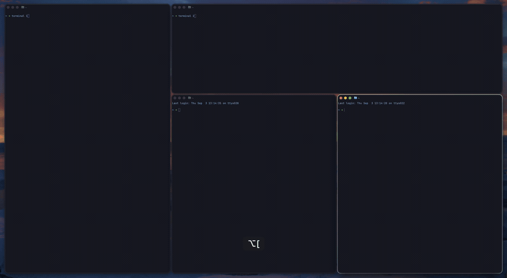

# rift-container-highlighter

Flashes an outline around every container in the active [rift](https://github.com/acsandmann/rift)
workspace, so you can see the container tree before running a command that acts on it.



Four terminals in two nesting levels. Each `ascend` (`⌥[`) walks the selection one level out and
flashes what it now points at: the inner container in green, then the whole workspace in cyan when
the selection reaches root. `descend` (`⌥]`) walks back in.

In rift's `traditional` and `bsp` layouts the tree is invisible. Two windows side by side look
identical whether they are siblings in the root container or a nested sub-container next to a third
window — which makes `move_node`, `join_window`, `unjoin_windows`, `toggle_orientation` and
`ascend`/`descend` guesswork. This draws the tree for a second when you ask, or right after you
change it.

Each container gets a band that is opaque at its outer edge and fades to transparent inward across
the member windows. Colour comes from nesting depth, and deeper containers get narrower bands so a
child sharing an edge with its parent still reads as two levels.

A container that is its parent's only child is skipped: it spans exactly what its parent spans, so
its outline cannot be told apart from an outline of the parent. It is drawn anyway when it holds the
selection, since the selection always has to be visible.

The container drawn at **full opacity is the one holding the layout selection — what the next
structural command will act on.** That is the useful part. `ascend` and `descend` do not move
anything; they walk the selection up and down the tree, so that `move_node` moves a single window or
a whole container depending on where the selection sits. Without a visual cue you find out by
pressing the key and undoing it. If the selection is on a bare window, no container is bright; if it
has been walked all the way up, the whole workspace is outlined.

## Why outlines and not coloured window borders

Recolouring each window's border (via JankyBorders' `apply-to`, say) is much less work and needs no
drawing at all. It cannot do the job. Any per-window property — border colour, background,
brightness, alpha — gives each window exactly one value, which is a *partition*. Nesting is a
hierarchy, so no assignment of per-window colours can show that container B sits inside container A
while both are on screen. Showing every container simultaneously requires drawing, so this draws.

## Requirements

- macOS. Uses SkyLight, a private framework.
- rift, running. Version-sensitive: see [Versioning](#versioning).
- Accessibility permission is needed by **rift**, not by this tool. It only reads rift's IPC and
  creates its own overlay window.

## Install

```sh
cargo install --path .
```

## Usage

```
rift-container-highlighter peek                    # flash the current tree
rift-container-highlighter peek --ms 10000         # ... and hold it, for tuning
rift-container-highlighter reset                   # clear a flash left on screen
rift-container-highlighter themes                  # theme names with a built-in palette
rift-container-highlighter dump                    # layout with per-node frames, computed rects, config
```

There is no daemon. Each invocation queries rift, draws, holds, and exits; the window server
discards the overlay when the process ends, which is also why `reset` is just a kill.

The selected window gets a band of its own, so a press always produces feedback. Without it a flat
workspace and any selection resting on a leaf both draw nothing, which looks the same as a dead
keybinding. Only the selected window is drawn — outlining every window would just restate what is
already on screen. It draws at `window_alpha` rather than full opacity, because it shares a palette
slot with any container at the same depth and alpha is the only thing separating them.

A flash retires any flash already on screen before drawing, so tapping a binding repeatedly does
not leave a stale overlay showing the previous tree for the rest of its own timer.

## Keybindings

One binding, plus rift's own `ascend` and `descend`. Nothing is wrapped or rebound:

```toml
# ~/.config/rift/config.toml
"Alt + Backslash"    = { exec = "/path/to/rift-container-highlighter peek" }
"Alt + BracketLeft"  = "ascend"
"Alt + BracketRight" = "descend"
```

None of the three modifies the tree, so they belong with your focus bindings rather than with the
ones that move windows.

Use an **absolute path**: rift runs as a launchd agent with no `PATH`, so a bare binary name
silently does nothing.

Punctuation keys are worth preferring here. A rift hotkey swallows the key before the terminal sees
it, so a letter is easy to lose to something else: `Alt + P` is Claude Code's model switcher and
`Alt + D` is zsh's `kill-word`.

## Flashing automatically

`ascend` and `descend` move the selection without changing the tree, so they emit no
`layout_changed`. rift 0.5.6 added `selection_changed` for exactly them. Subscribe to it and the
flash follows the selection with no wrapper in the loop:

```toml
# ~/.config/rift/config.toml
run_on_start = [
  "/path/to/rift-cli subscribe cli --event selection_changed --command /bin/sh --args -c --args '/path/to/rift-container-highlighter peek'",
]
```

It fires only for `ascend` and `descend`, and only when the selection actually moved — so a press at
the top or bottom of the tree flashes nothing, and a focus change never flashes at all.

**The command must go through `/bin/sh`.** rift appends the event JSON as a trailing argument to
every CLI subscription, so `--command /path/to/rift-container-highlighter --args peek` runs
`… peek '{"type":…}'`, which is rejected as an unexpected argument — nothing draws, and the failure
is silent. `sh -c '<command>'` takes the JSON as `$0` and ignores it.

Spell out all three paths. `run_on_start` resolves the first token against rift's launchd
environment, and the generated plist carries whatever `PATH` it was created with, so a bare
`rift-cli` resolves on some installs and not others.

`run_on_start` runs at rift startup only, not on a config hot reload, so the subscription is
registered once per rift launch. To add it without restarting, run the same `rift-cli subscribe`
line by hand once; `rift-cli subscribe list-cli` shows what is registered.

The tree-modifying commands (`join_window`, `move_node`, `toggle_orientation`, `unjoin`) already
fire `layout_changed`, so the same recipe covers them:

```toml
  "/path/to/rift-cli subscribe cli --event layout_changed --command /bin/sh --args -c --args '/path/to/rift-container-highlighter peek'",
```

That one also fires on divider drags and on windows opening and closing, so it flashes more than
most people want. Suppressing that needs a structure hash cached between runs, which this does not
do.

rift keybindings fire on key-down only — there is no release action — so hold-to-peek is not
possible. `peek` is a timed flash.

## Configuration

Optional, at `~/.config/rift-container-highlighter/config.toml`. See
[`config.example.toml`](config.example.toml) for every key and its default. The file is re-read on
every invocation, so changes apply to the next flash with nothing to reload.

`corner_radius` is the one worth tuning: macOS 26 rounds window corners considerably more than
earlier releases, and this tool does not read the real per-window value. JankyBorders does, via
`SLSWindowIteratorGetCornerRadii`, which would mean vendoring the window-iterator API.

Red is deliberately absent from every built-in palette. Add it to `palette` if you want it — the
reasoning is in `config.example.toml`.

### Theme integration

`theme` takes a canonical name and selects a built-in palette. If you drive your tools from a single
script, have it write that one line; `rift-container-highlighter themes` lists the names that have a
palette, so the script can warn instead of letting an unknown name fall back.

## Versioning

`rift-client` and `rift-protocol` are git dependencies pinned to the tag of the rift release this
was built against — currently `v0.5.6`. **Pin the tag of the rift you actually run.** The IPC wire
format drifts between releases: built against `main`, `get_layout_state` fails against a 0.5.5
daemon with `data did not match any variant of untagged enum RiftResponse`.

**Do not `cargo add rift-client` or `rift-protocol`.** Those crates.io names belong to unrelated
third-party projects; rift publishes neither.

On a rift upgrade: bump the rev in `Cargo.toml`, re-diff `src/vendor/` against the new tag, rebuild,
and run `dump` before anything else.

## Vendored code

`src/vendor/` contains rift's CGS overlay bindings, copied under Apache-2.0 — see
[`NOTICE`](NOTICE). This is the upstream-endorsed arrangement rather than a stopgap:
[rift#467](https://github.com/acsandmann/rift/issues/467) asked for them as a published crate and
was closed, since `rift-client` is IPC-only by design. Deviations from upstream are listed in each
file's header and are mechanical only.

One thing that cost real time and is worth knowing if you write something similar: **a CFRunLoop
must be turning or the overlay is never composited**. Create the windows and then block in
`thread::sleep` and you get an empty screen with every CGS call returning success and no error
anywhere.

## Known limits

- **A container's rect is the layout target, not where its windows are right now.** rift reports
  the frame the layout engine allocated, before any window animation, so during a resize or a
  workspace switch the band can sit where the windows are heading rather than where they are.
- **Colours are keyed to depth, not container identity**, so a container does not keep its colour
  across a structural change. v0.5.6 added a stable `node_id`, so keying on identity is now
  possible; this does not do it.
- **A subscription cannot pass the event payload through.** `selection_changed` carries the full
  layout, but the trailing-JSON argument has to be discarded by `sh`, so `peek` re-queries rift
  instead of drawing what the event already delivered. One redundant IPC call per flash.
- Nesting deeper than the palette wraps colours.

## Licence

Apache-2.0. See [`LICENSE`](LICENSE) and [`NOTICE`](NOTICE).
